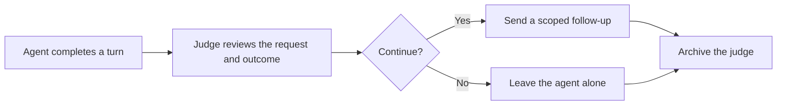

<div align="center">


# Paseo Juke


[Features](#features) · [Getting started](#getting-started) · [Compatibility](#compatibility) · [Reference](docs/REFERENCE.md)

</div>

🛑 Agents love to stop at *"Here's my plan…"* or *"Want me to go ahead?"* when you already asked them to do the work.

🧑‍⚖️ Juke catches that. After every finished turn, a short-lived judge reads what you asked and what the agent actually did. If the agent stopped short, Juke sends it back to work. If not, it stays out of the way.

## Features

| Feature | What you get |
| --- | --- |
| 🧠 Semantic review | A model judges intent and follow-through, not a keyword score |
| 🎯 Two continuation cases | Unperformed work and unnecessary permission questions |
| 🚧 Clear boundaries | Real questions, genuine blockers and unauthorized actions are left alone |
| ⚖️ Your choice of judge | Reuse the judged agent's model, or pick a provider, model and reasoning level |
| 🔁 Loop protection | Stale verdicts, Juke's own follow-ups and Role Orchestrator runs are skipped |
| ⏸️ One-switch pause | Turn automatic assessments off without removing the plugin |

## How it fits



## Getting started

The root contains the original plugin. The separately preserved **Paseo 0.9.1 compatibility snapshot** includes the settings UI used by the recovered installation:

```bash
git clone https://github.com/papag00se/paseo-juke-plugin.git
cd paseo-juke-plugin/compatibility/paseo-0.9.1
npm ci --legacy-peer-deps
npm run typecheck
paseo plugin install "$PWD"
```

Open **Settings → Plugins → Juke → Settings**. Automatic assessment is on by default. Under **Judge model**, keep *Same as the agent being judged* or choose a provider, model and reasoning level. Every assessment runs a separate judge agent, so it uses model quota. Each verdict appears in the plugin's **Logs** menu.


## Compatibility

The root targets Paseo 0.9.0 and later. The settings-enabled snapshot is bounded to **0.9.1–0.9.x**. It is published alongside the original implementation; the two variants share the `juke` runtime ID and should not be installed together under that ID.

Juke does not own execution permissions. It evaluates the user's existing task scope and leaves tool authorization to the agent harness. Role Orchestrator-owned runs are excluded because they have their own completion system.

## Development

From the selected variant:

```bash
npm run typecheck
npm test
```

The compatibility snapshot additionally provides `npm run test:settings`. `npm run eval` uses a real model and is separate from the unit suite.

[Judge behavior, settings, evidence limits, and tests →](docs/REFERENCE.md) · [0.9.1 snapshot](compatibility/paseo-0.9.1)
