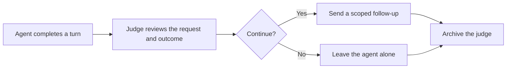
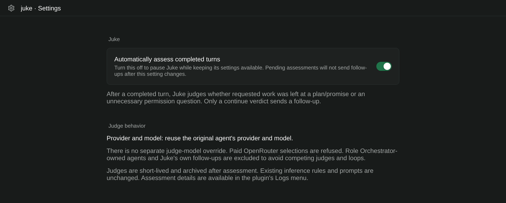

<div align="center">


# Paseo Juke


[The nine jukes](#the-nine-jukes) · [Features](#features) · [Getting started](#getting-started) · [Compatibility](#compatibility) · [Reference](docs/REFERENCE.md)

</div>

🛑 Agents love to stop at *"Here's my plan…"* or *"Want me to go ahead?"* when you already asked them to do the work.

🧑‍⚖️ Juke catches that. After every finished turn, a short-lived judge reads what you asked and what the agent actually did. If the agent stopped short, Juke sends it back to work. If not, it stays out of the way.

## The nine jukes

A "juke" is an agent faking the end of a turn while work is still owed. Juke catches nine kinds:

| # | Juke | Example | What Juke does |
| --- | --- | --- | --- |
| 1 | **Answered instead of doing the work** — you wanted work done, the agent treated it as a question | *"Can you fix the typo?"* → *"Yes, it should say 'Installation'."* | Tells it to make the fix |
| 2 | **Said it would do it, then stopped** — the agent says it will do something, then ends its turn | *"I'll rename getUser to fetchUser everywhere next."* (nothing renamed) | Tells it to do what it announced |
| 3 | **Stopped at obvious next steps** — your direction is clear, the agent lists matching next steps, then asks to go ahead or just stops | *"Lint fails on an unused import. Want me to remove it?"* | Tells it to take those steps |
| 4 | **Dropped the task after your steer** — it answers your mid-task steer, then abandons the work | *"Use zod for validation."* → *"Got it, zod is a better fit."* (task abandoned) | Tells it to apply your steer and finish the task |
| 5 | **Said it was done when it wasn't** — the agent says "done" after doing less than you asked | Fixed 2 of 4 folders, or *"tests should pass now"* without running them | Names what's missing or unchecked |
| 6 | **Gave up at the first obstacle** — the agent hits one obstacle and says it's stuck | *"The generator isn't installed, so I can't continue."* (it's a project dependency) | Points to a way around it |
| 7 | **Asked something it could look up** — the answer was already in the chat or the files | *"Which port does the server use?"* (it's in the config file) | Tells it where to look, then to carry on |
| 8 | **Told you to do its work** — the agent tells you to do steps it could do itself | *"To finish, run `npm run migrate`."* | Tells it to run those steps |
| 9 | **Paused for no reason** — nothing blocks it, but the agent stops partway | *"This is a long job, so I'll pause here."* (12 of 40 done) | Tells it to finish; long jobs are normal |

Juke leaves the agent alone when you only asked a question, asked for a plan or a status-only answer, said to hold off, asked for a checkpoint, or truly changed direction. It also stays out when the work is really done or really blocked, when only you have the answer or the access (a password, your account, a choice of approach), or when the next step is risky or out of scope (deleting, publishing, spending money).

Each juke has a switch with the same title in settings. Logs show its short id (for example `derailed-by-steering`). [Exact judging rules →](docs/REFERENCE.md)

## Features

| Feature | What you get |
| --- | --- |
| 🧠 Semantic review | A model judges intent and follow-through, not a keyword score |
| 🎯 Nine jukes | Each common way an agent stops early, above |
| 🚧 Clear boundaries | Real questions, genuine blockers and unauthorized actions are left alone |
| ⚖️ Your choice of judge | Reuse the judged agent's model, or pick a provider, model and reasoning level |
| 🔁 Loop protection | Stale verdicts, Juke's own follow-ups and Role Orchestrator runs are skipped |
| 🎛️ Per-juke switches | Turn off any juke you don't want caught |
| ⏸️ One-switch pause | Turn automatic assessments off without removing the plugin |

## How it fits



## Getting started

```bash
git clone https://github.com/papag00se/paseo-juke-plugin.git
cd paseo-juke-plugin
npm ci --legacy-peer-deps
npm run typecheck
paseo plugin install "$PWD"
```

Open **Settings → Plugins → Juke → Settings**. Automatic assessment is on by default. Under **What Juke catches**, each juke has its own switch with a one-line example; all start on. Turn one off and agents may stop that way without a nudge. Under **Judge model**, keep *Same as the agent being judged* or choose a provider, model and reasoning level. Every assessment runs a separate judge agent, so it uses model quota. Each verdict appears in the plugin's **Logs** menu.



## Compatibility

Juke targets Paseo **0.9.1–0.9.x**. The pre-0.9.1 implementation is in Git history (before the Paseo 0.9.1 port became the only version).

Juke does not own execution permissions. It evaluates the user's existing task scope and leaves tool authorization to the agent harness. Role Orchestrator-owned runs are excluded because they have their own completion system.

## Development

```bash
npm run typecheck
npm test
```

`npm run test:settings` runs only the settings tests. `npm run eval` checks the judge against 108 example conversations on a real model, including ones built to trick it; it is separate from the unit suite. [Latest results →](eval/RESULTS.md)

[Judge behavior, settings, evidence limits, and tests →](docs/REFERENCE.md)
